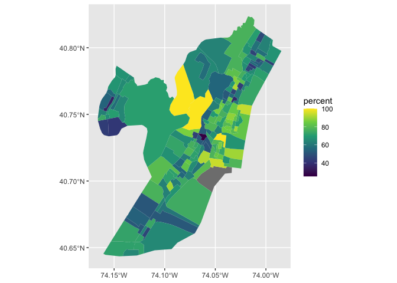
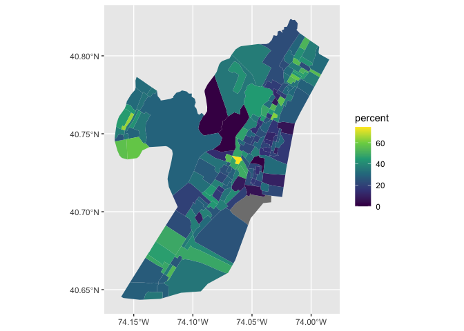
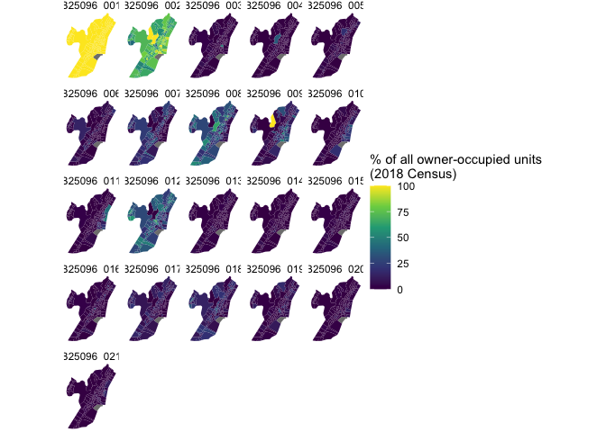
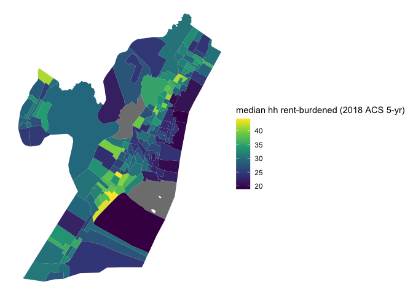
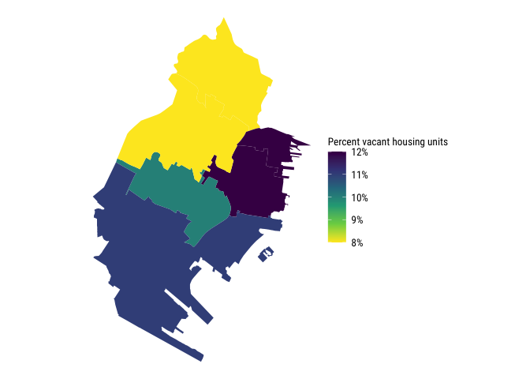
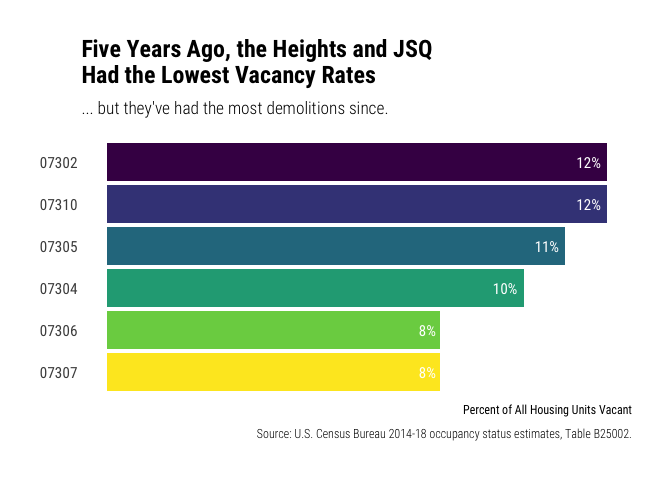
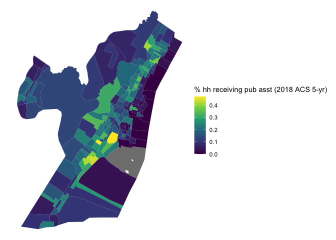
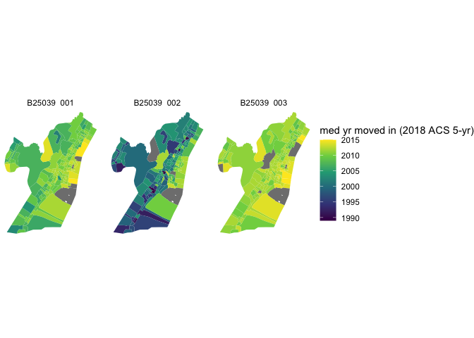
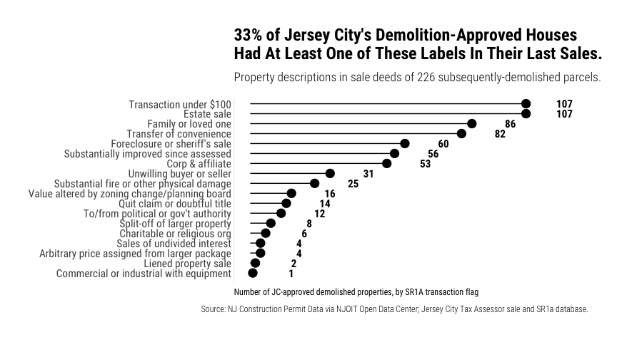
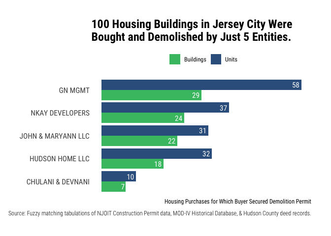

Jersey City Demolitions 2018-2022: Part III
================

Sarah Ligon ([@ligonish](https://github.com/ligonish))  
December 2022

In the middle of 2022 — the same year Jersey City reported [demolishing
more housing units than any municipality in New
Jersey](https://www.nj.gov/dca/divisions/codes/reporter/2021yearly/DEMO_21.pdf)
— the *New York Times* declared it “the [most expensive city in which to
rent a home in the United
States](https://www.nytimes.com/2022/07/28/realestate/which-city-is-most-expensive-for-renters-you-might-be-surprised.html)”.

This final installment of a three-part series, originally written for
Lucy Block & Oksana Miranova’s “Spatial Analysis & Data Visualization”
grad course at NYU, investigates patterns in the housing demolitions
Jersey City administrators have approved in the five years since New
Jersey began digitizing municipal construction permit records.

Full write-up of this analysis appears in [“Whose House is Jersey City
Tearing Down? Part 3 of
3”.](https://medium.com/@srligon/whose-house-is-jersey-city-tearing-down-903cdeaa6c6a)

See also [Part
1](https://medium.com/@srligon/whose-house-is-jersey-city-tearing-down-c1092cdbbc43)
& [Part
2](https://medium.com/@srligon/whose-house-is-jersey-city-tearing-down-part-ii-3212b1514d6f).

### Data Sources

- [NJOIT Open Data Center, NJ Construction Permit
  Data](https://data.nj.gov/Reference-Data/NJ-Construction-Permit-Data/w9se-dmra)
- [Rutgers University + NJ Dep’t of Community Affairs, N.J. MOD-IV
  Historical Database](http://modiv.rutgers.edu) See R Project
  “Documentation” folder for detailed variable descriptions.
- [Zillow Home Value Index (ZHVI) Condo/Co-op
  Timeseries](https://www.zillow.com/research/data/), by ZIP
- [Hudson County Tax Assessor Sales/Deeds/Non-Usable Transaction Code
  Database, Jersey City Parcels,
  1990-2022](https://tax1.co.monmouth.nj.us/cgi-bin/prc6.cgi?&ms_user=monm&passwd=data&srch_type=0&adv=0&out_type=0&district=0906),
  downloaded 2022-11-13
- [New Jersey Division of Taxation, Categories of Non-Usable Deed
  Transactions
  Manual](https://www.state.nj.us/treasury/taxation/pdf/lpt/guidelines33.pdf)

### Dependent Libraries

``` r
library(tidyverse)   # data cleaning & manipulation
library(janitor)     # cleaner variable names
library(lubridate)   # normalize dates

library(RSocrata)    # access NJ.gov APIs
library(httr)        # general APIs
library(rvest)       # basic html scrape for USPS standard street abbv.

library(fuzzyjoin)   # joins on approximate string matches
library(priceR)      # CPI-adjust property sale values
library(campfin)     # normalize addresses & owner entity spellings
library(tidytext)    # for owner name/address messes
library(tidystringdist) # fuzzy-match owner entities

# NB: R's fedmatch package, created by Federal Reserve staff, was designed to track tangled owner entities on the US corporate lending market and as such expands on much of the functionality of the packages and methods here; future iterations of this project will include it.
```

### Data Collection

#### NJ Construction Permits API

Set URL to request all demolition data for Jersey City:

``` r
token <- "EPwLOkcTwraIxyKBpyGcRPaR8"
url <- "https://data.nj.gov/resource/w9se-dmra.json?TreasuryCode=0906&Permit Type=13"

demos_raw <- read.socrata(url = url, app_token = token) 

rm(token, url)
```

This dataset was updated on December 9, 2022. We have 803 raw records of
demolition permits and/or certificates of approval issued in Jersey City
since April 2017.

#### MOD-IV Property Tax Data c. 2016

Source: [Rutgers University & NJ Department of Community Affairs MOD-IV
Historical Database](https://modiv.rutgers.edu/)

2016 parcel records offer a baseline year of street addresses and unit
counts before demolition dataset begins.

``` r
mod_iv_2016 <- read_csv("data_raw/mod_iv_data_2016_jc.csv") %>%  
  clean_names() 
```

#### Jersey City Parcel Sale Histories

Source: [Hudson County Tax Assessment & Sales Public
Dataset](https://tax1.co.monmouth.nj.us/cgi-bin/prc6.cgi?&ms_user=monm&passwd=data&district=0906&adv=0&out_type=0&srch_type=2),
downloaded December 8, 2022.

``` r
deeds_raw <- read_csv("data_raw/2022_11_13_jc_parcel_deed_histories.csv") %>% 
  clean_names %>% 
  remove_constant()
```

### Data Cleaning

#### Jersey City Demolition Permit Set

``` r
demos <- demos_raw %>% 
  select(recordid,
         block, 
         lot,
         permitstatusdesc,
         permitdate,
         certdate,
         certcount,
         buildfee,
         plumbfee,
         electfee,
         firefee,
         dcafee,
         certfee,
         elevfee,
         otherfee,
         totalfee,
         constcost,
         salegained,
         rentgained,
         usegroup,
         usegroupdesc,
         processdate) %>% 
  mutate(
    block_ext = str_extract(block, "(?<=\\.)[:alnum:]+"),
    block = case_when(
      is.na(block_ext) ~ block,
      block_ext > 0 ~ str_extract(block, "[:alnum:]+(?=\\.?)")),
    lot_ext = str_extract(lot, "(?<=\\.)[:alnum:]+"),
    lot = case_when(
      is.na(lot_ext) ~ lot,
      lot_ext > 0 ~ str_extract(lot, "[:alnum:]+(?=\\.?)")),
    block_lot = paste0(block, "_", lot),
    ibcnj_use_desc = case_when(
      usegroup == "R-1" ~ "Hotels, motels, boarding houses etc",
      usegroup == "R-2" ~ "3 or more units",
      usegroup == "R-3" ~ "1-2 units, >3 stories",
      usegroup == "R-5" ~ "1-2 units, <= 3 stories"
    ),
    permitdate = date(permitdate),
    certdate = date(certdate),
    last_pc_year = case_when(
      certdate > permitdate ~ year(certdate),  # signoff yr
      permitdate >= certdate | is.na(certdate) ~ year(permitdate)
    )) %>% 
  relocate(lot_ext, block_lot, .after = lot)
```

#### MOD-IV Tax Assessment Archive Set

``` r
mod_iv_2016 <- mod_iv_2016 %>% 
  select(
    property_id_blk,
    property_id_lot,
    property_id_qualifier,
    qualification_code_name,
    property_class,
    property_class_code_name,
    property_location,
    building_description,
    land_description,
    zoning,
    owner_name,
    number_of_owners,
    deed_date_mmddyy,
    sale_price,
    sale_assessment,
    sale_sr1a_non_usable_code,
    number_of_dwellings,
    year_constructed,
    land_value,
    property_use_code,
    senior_citizen_count,
    veteran_count,
    widows_of_veterans_count,
    surviving_spouse_count,
    disable_person_count,
    old_block,
    old_lot
  ) %>% 
  mutate(property_id_lot = as.character(property_id_lot),
         lot_ext = str_extract(property_id_lot, "(?<=\\.)[:digit:]+"),
         property_id_lot = case_when(
           is.na(lot_ext) ~ property_id_lot,
           lot_ext > 0 ~ str_extract(property_id_lot, "[:digit:]+(?=\\.?)")),
         block_lot = paste0(property_id_blk, "_", property_id_lot),
         number_of_dwellings = as.integer(number_of_dwellings)
  ) %>% 
  relocate(lot_ext, block_lot, .after = property_id_lot)
```

### Data Merge

``` r
merge_test <- anti_join(demos, mod_iv_2016, by = "block_lot") 
tibble(merge_test$recordid)
```

    ## # A tibble: 12 × 1
    ##    `merge_test$recordid`
    ##    <chr>                
    ##  1 00001924             
    ##  2 00002278             
    ##  3 00014232             
    ##  4 00014233             
    ##  5 00014234             
    ##  6 00053705             
    ##  7 00061524             
    ##  8 20003002             
    ##  9 20003009             
    ## 10 20003071             
    ## 11 20003075             
    ## 12 20003302

Searched mismatches on deed list through JC Tax Assessor so I can input
by hand (see note below; a few records had pre-2016 permits with long
lags on projects but were already torn down 2016.)

Of these, only two are listed as residential use.

00002278, Block 9501, Lot 8: 605 Pavonia Avenue. -\> Property Class
Code: Apartment \[Code: 4C\] Owner Name: JOURNAL SQUARE ASSOCIATES, LLC
SR1A Code on 2013-06-25 deed: 24 Year Constructed: 1930 Building
Description: 5S-B-A-31U-H Prev. owned since 2004-05-24, Balwin Realty,
Inc Note JSQ Associates also owns/owned lots 4, 6, 7, 8, 10, 11, 12, 13,
14, 15 on same block. Lot 23 is 1 JSQ. The 9501 search is also useful bc
even the JCRA is listed w/ two alternate spellings.

00053705, Block 13002, Lot 4: 159 Morgan Street. -\> Property Class
Code: Vacant Land \[Code: 1 \] going back to 1989 Owner Name: MORGAN
POINT DEVELOPMENT CO.,LLC, Deed Date: 2004-10-08 Old Block: 139 Old Lot:
127

``` r
tax_demo_merge <- demos %>% 
  left_join(mod_iv_2016, by = "block_lot", keep = F) %>%
  arrange(recordid) %>% 
  filter(recordid!=lag(recordid) | is.na(lag(recordid)))
```

803 obs of 55 variables.

Input missing data for demo records 00002278 & 00053705:

``` r
tax_demo_merge <- tax_demo_merge %>% 
  mutate(
    property_location = case_when(
      recordid == "00002278" ~ "605 PAVONIA AVE.",
      recordid == "00053705" ~ "159 MORGAN STREET",
      TRUE ~ property_location
    ),
    building_description = case_when(
      recordid == "00002278" ~ "5S-B-A-31U-H",
      recordid == "00053705" ~ "VACANT LAND",
      TRUE ~ building_description
    ),
    property_class = case_when(
      recordid == "00002278" ~ "4C",
      recordid == "00053705" ~ "1",
      TRUE ~ property_class
    ),
    property_class_code_name = case_when(
      recordid == "00002278" ~ "Apartment",
      recordid == "00053705" ~ "Vacant Land",
      TRUE ~ property_class_code_name
    ),
    year_constructed = case_when(
      recordid == "00002278" ~ "1930",
      TRUE ~ year_constructed
    ),
    old_block = case_when(
      recordid == "00002278" ~ "582",
      recordid == "00053705" ~ "139",
      TRUE ~ old_block
    ),
    old_lot = case_when(
      recordid == "00002278" ~ "91",
      recordid == "00053705" ~ "127",
      TRUE ~ old_lot
    )
  )
```

Filter down to both explicit & imputable residential demolitions:

``` r
poss_res_demos <- tax_demo_merge %>%
  filter(!str_starts(usegroup, 'R')) %>%
  filter(!is.na(number_of_dwellings)) %>%
  filter(property_class_code_name == "Residential") 
  # isolates parcels whose 2017 or later demolition application listed them as non-residential property, but whose 2016 tax record listed them as containing a non-zero number of residential units.

res_demos <- tax_demo_merge %>% 
  filter(str_starts(usegroup, 'R')) %>% 
  rows_append(poss_res_demos) %>% 
  select(-c(usegroupdesc,
            processdate,
            property_id_blk,
            property_id_lot,
            property_id_qualifier,
            lot_ext.y,
            contains("fee"),
            qualification_code_name,
            property_use_code)
         )

rm(poss_res_demos)  # 671 obs
```

Generate unit counts

``` r
res_demos <- res_demos %>% 
  mutate(modiv_units = as.integer(str_extract(building_description, pattern = "[:digit:]+(?=U)"))) %>% 
  mutate(salegained = abs(as.numeric(salegained)),
         rentgained = abs(as.numeric(rentgained))) %>%
  mutate(declared_loss = case_when(
    salegained != rentgained ~ salegained + rentgained,
    salegained == rentgained & salegained != 0 ~ salegained,
    salegained + rentgained == 0 ~ 0)) %>%  
  mutate(unit_estimate = ifelse(declared_loss == 0, modiv_units, declared_loss)) %>% 
  mutate(unit_estimate = ifelse(is.na(unit_estimate), number_of_dwellings, unit_estimate))
```

``` r
write_csv(res_demos, "data_working/jc_res_demos_12_11_2022.csv")
```

Quick look at missing unit counts, unit summary in general, and unit
summaries by year:

``` r
yearly_unit_summary <- res_demos %>%
  filter(last_pc_year > 2017) %>%  # incomplete records from 2017 & earlier
  group_by(last_pc_year) %>% 
  summarize(
    min_declared = min(declared_loss, na.rm = T),
    max_declared = max(declared_loss, na.rm = T),
    mean_declared = mean(declared_loss, na.rm = T),
    tot_declared = sum(declared_loss, na.rm = T),
    min_est = min(unit_estimate, na.rm = T),
    max_est = max(unit_estimate, na.rm = T),
    mean_est = mean(unit_estimate, na.rm = T),
    tot_est = sum(unit_estimate, na.rm = T),
    est_diff = round(((tot_est - tot_declared) / tot_declared) * 100)) 
```

19% more estimated than declared.

Remove the extra dfs we’re not using:

``` r
rm(merge_test, demos, demos_raw, empties, mod_iv_2016, tax_demo_merge, unit_summary, yearly_unit_summary)
```

### Geocoding

(See “r_scripts/12_02_NJOGIS_API_experiment.R” for usable source code.)

Here’s how I pulled official street addresses w/ coordinates from
NJ.gov’s 911 service for all these parcels; it took forever, so don’t
actually run this

test_jc \<- st_read(“<a
href="https://services2.arcgis.com/XVOqAjTOJ5P6ngMu/arcgis/rest/services/AddressPoints/FeatureServer/0/query?where=INC_MUNI%20%3D%20&#39;885264&#39;&amp;outFields=ADD_NUMBER,ST_NAME,ST_POSTYP,PRIMENAME,FULLADDR,LST_NAME,LST_PNAME,MSAGCOMM,POST_COMM,POST_CODE,PLACE_TYPE,LONG_,LAT&amp;outSR=4326&amp;f=json"
class="uri">https://services2.arcgis.com/XVOqAjTOJ5P6ngMu/arcgis/rest/services/AddressPoints/FeatureServer/0/query?where=INC_MUNI%20%3D%20’885264’&amp;outFields=ADD_NUMBER,ST_NAME,ST_POSTYP,PRIMENAME,FULLADDR,LST_NAME,LST_PNAME,MSAGCOMM,POST_COMM,POST_CODE,PLACE_TYPE,LONG_,LAT&amp;outSR=4326&amp;f=json</a>”)

Saved as “data_raw/jc_parcel_addresses_coords_12_02_2022.csv”

See metadata for these here:
<https://services2.arcgis.com/XVOqAjTOJ5P6ngMu/arcgis/rest/services/AddressPoints/FeatureServer/0>
Spatial Reference: 102711 (3424) aka EPSG:3424

The addresses weren’t abbreviated consistently, so let’s expand them in
line with USPS standards for street abbreviations:

``` r
usps <- read_html("https://pe.usps.com/text/pub28/28apc_002.htm") %>% 
  html_node(xpath = '//*[@id="ep533076"]') %>% 
  html_table() %>% 
  row_to_names(row_number = 1) %>% 
  clean_names() %>% 
  select(3,1) %>% 
  distinct()
```

And now we can normalize the addresses we actually have in tax-merged
data:

``` r
res_demos <- res_demos %>%
  mutate(
    fulladdr = str_replace(
      property_location, "[-][:digit:]+",""),
    fulladdr = str_replace(
      fulladdr, "\\.5", " 1/2"),
    fulladdr = str_to_title(normal_address(
      fulladdr, abbs = usps))
    ) %>% 
  relocate(fulladdr, .after = block_lot)

rm(usps)
```

OK. *Now* let’s import the geolocation data I pulled from NJ.gov (it’s
their 911 call address pinpoints).

(See project folder’s “r_scripts/12_02_NJOGIS_API_experiment.R” for
usable source code walking through NJOGIS API access vignette and url
syntax.)

``` r
njogis_jc_addr <- read_csv("data_raw/jc_parcel_addresses_coords_12_02_2022.csv") %>% 
  clean_names
```

Cleaning address data our existing demo set to better align with NJ’s
standard address syntax and spelling conventions (see below for
preferable string cleaning and tokenizing methodology using tidytext
conventions; this was nothing if not a learning-curve project!)

``` r
res_demos <- res_demos %>% 
  mutate(
    fulladdr = str_replace_all(
      fulladdr, pattern = c("Kennedy" = "John F Kennedy", 
                            "Av(?!enue)" = "Avenue",
                            "Ml King" = "Martin Luther King Junior",
                            "Mc Adoo" = "Mcadoo",
                            "De Kalb" = "Dekalb",
                            "St Pauls" = "Saint Pauls",
                            "Tonnele" = "Tonnelle",
                            "First" = "1st",
                            "Second" = "2nd",
                            "Third" = "3rd",
                            "Fourth" = "4th",
                            "Fifth" = "5th",
                            "Sixth" = "6th",
                            "Seventh" = "7th",
                            "Eighth" = "8th",
                            "Ninth" = "9th")
    )
  ) %>% 
  mutate(  
    fulladdr = case_when(  # hand-imputing adjacent buildings for geolocation
      property_location == "119-121 MONTICELLO AVE." ~ "117 Monticello Avenue",  
      property_location == "319-21 JOHNSTON AVE." ~ "317 Johnston Avenue",
      property_location == "414-16 FIRST ST." ~ "418 1st Street",
      property_location == "270-2 NEWARK AVE." ~ "333 3rd Street",
      property_location == "38 WAVERLY ST." ~ "40 Waverly Street",
      property_location == "27-25 JEFFERSON AVE." ~ "29 Jefferson Avenue",
      property_location == "330-330.5 FIFTH ST." ~ "326 5th Street",
      property_location == "9 LIENAU PL." ~ "97 Waverly Street",
      property_location == "177-175 ACADEMY ST." ~ "173 Academy Street",
      property_location == "192-94 MC ADOO AVE." ~ "188 Mcadoo Avenue",
      property_location == "43-35 CHARLES AVE." ~ "41 Charles Street",
      property_location == "543-7 M.L. KING DRIVE" ~ "541 Martin Luther King Junior Drive",
      recordid == "00053705" ~ "160 Morgan Street",
      recordid == "00055440" ~ "20 Corbin Avenue",
      TRUE ~ as.character(fulladdr)
    )
  )
```

Join up the NJ coordinate data:

``` r
merge_test <- anti_join(res_demos, njogis_jc_addr, by = "fulladdr")

rm(merge_test)

res_demos <- res_demos %>% 
  left_join(njogis_jc_addr, by = "fulladdr") %>%
  arrange(recordid) %>% 
  filter(recordid!=lag(recordid) | is.na(lag(recordid))) %>% 
  select(-c(lst_name, lst_pname, msagcomm, place_type))
```

Save full version in case we need to generate any last-minute variables
within R:

``` r
write_csv(res_demos, "data_working/geolocated_demos_12_11_2022.csv")
```

And a simpler version for QGIS:

``` r
res_demos %>% 
  select(recordid,
         block,
         lot,
         fulladdr,
         post_code,
         permitdate,
         certdate,
         last_pc_year,
         constcost,
         usegroup,
         building_description,
         unit_estimate,
         year_constructed,
         long,
         lat) %>% 
write_csv("data_working/for_gis_geolocated_demos_12_11_2022.csv")
```

### Sale Histories: Transactions & Owners

I wanted to look into transaction histories surrounding each parcel’s
demolition permit date, so I downloaded the full set of public-facing
deed histories available for Jersey City through the Hudson County Tax
Assessors’ website (see Source section above.) Reader: a can of *worms*,
in many ways more than one. Let’s get started.

See “data_raw” in project folder for original .csv file, accessed
December and up-to-date as of November 2022.

``` r
deeds <- deeds_raw %>% 
  select(-c(recorded_date, book, page, cl_4_use)) %>% 
  mutate(
    block_ext = str_extract(block, "(?<=\\.)[:alnum:]+"),
    block = case_when(
      is.na(block_ext) ~ block,
      block_ext > 0 ~ str_extract(block, "[:alnum:]+(?=\\.?)")),
    lot_ext = str_extract(lot, "(?<=\\.)[:alnum:]+"),
    lot = case_when(
      is.na(lot_ext) ~ lot,
      lot_ext > 0 ~ str_extract(lot, "[:alnum:]+(?=\\.?)")),
    block_lot = paste0(block, "_", lot),
    deed_date = date(deed_date),
    sale_id = row_number()
  ) %>% 
  relocate(block_lot, lot_ext, property_location, .before = grantors_name_seller)

rm(deeds_raw)

deeds %>% 
  get_dupes(sale_id) # sale_id is a unique identifier
```

    ## # A tibble: 0 × 25
    ## # … with 25 variables: sale_id <int>, dupe_count <int>, block_lot <chr>,
    ## #   lot_ext <chr>, property_location <chr>, grantors_name_seller <chr>,
    ## #   grantors_mailing_address <chr>, grantors_city_state_zip <chr>,
    ## #   grantees_name_buyer <chr>, grantees_mailing_address <chr>,
    ## #   grantees_city_state_zip <chr>, block <chr>, lot <chr>, qual <chr>,
    ## #   property_class <chr>, land_assmnt <dbl>, building_assmnt <dbl>,
    ## #   total_assmnt <dbl>, deed_date <date>, sale_price <dbl>, nu_code <dbl>, …
    ## # ℹ Use `colnames()` to see all variable names

Prep existing demo data for sale-history merge on each demo record.

``` r
sale_hist <- res_demos %>% 
  filter(recordid != "00053705") %>% # vacant lot
  mutate(
    old_block_ext = str_extract(old_block, "(?<=\\.)[:alnum:]+"),
    old_block = case_when(
      is.na(old_block_ext) ~ old_block,
      old_block_ext > 0 ~ str_extract(old_block, "[:alnum:]+(?=\\.?)")),
    old_lot_ext = str_extract(old_lot, "(?<=\\.)[:alnum:]+"),
    old_lot = case_when(
      is.na(old_lot_ext) ~ old_lot,
      old_lot_ext > 0 ~ str_extract(old_lot, "[:alnum:]+(?=\\.?)")),
    old_block_lot = paste0(old_block, "_", old_lot)
  ) %>% 
  select(
    recordid, block_lot, property_location, post_code, old_block_lot, permitdate, certdate, constcost, declared_loss, unit_estimate, long, lat
    )
```

Setting up a clunky but workable pattern to capture pre-2013 matches —
the Tax Assessor keeps transaction/deed records dating back to 1990, and
Jersey City changed all their block and lot numeration conventions in
2013:

``` r
bl_matches <- semi_join(deeds, sale_hist, by = "block_lot")

old_bl_matches <- semi_join(deeds, sale_hist, by = c("block_lot" = "old_block_lot"))

sale_matches <- semi_join(deeds, sale_hist, by = "property_location") %>%
  rows_insert(bl_matches, by = "sale_id", conflict = "ignore") %>% 
  rows_insert(old_bl_matches, by = "sale_id", conflict = "ignore")
  # 2,236 unique transaction records matched to demos on address and/or old or new block and lot numeration

bl_join <- left_join(sale_hist, sale_matches, by = "block_lot", keep = T) %>% 
  distinct(sale_id, .keep_all = T)

old_bl_join <- left_join(sale_hist, sale_matches, by = c("old_block_lot" = "block_lot"), keep = T) %>% 
  distinct(sale_id, .keep_all = T)

demos <- left_join(sale_hist, sale_matches, by = "property_location", keep = T) %>%
  rows_append(bl_join) %>% 
  rows_append(old_bl_join) %>% 
  distinct() %>% 
  arrange(recordid, sale_id) %>% 
  filter(!(recordid == lag(recordid) & is.na(sale_id)))  
     # 670 distinct demo records; 38 missing sales history

rm(bl_join, bl_matches, old_bl_join, old_bl_matches, sale_hist, sale_matches, res_demos)
```

### Inflation adjustment

Clean up the joined demo and sale history data, add an
inflation-adjusted sale price field to allow comparison, and add a
transaction counter per parcel

``` r
demos <- demos %>% 
  select(-c(block_lot.y, lot_ext, property_location.y, block, lot, qual, block_ext)) %>% 
  rename("block_lot" = "block_lot.x") %>% 
  mutate(deed_year = year(deed_date),
         sale_price_2021_adj = adjust_for_inflation(sale_price, deed_year, "US", to_date = 2021),
         sale_price_2021_adj = round_to_nearest(sale_price_2021_adj, 1), .after = sale_price)%>% 
  rename(
    property_location = property_location.x,
    seller_name = grantors_name_seller,
    seller_address = grantors_mailing_address,
    seller_city_state_zip = grantors_city_state_zip,
    buyer_name = grantees_name_buyer,
    buyer_address = grantees_mailing_address,
    buyer_city_state_zip = grantees_city_state_zip
  ) %>% 
  group_by(recordid) %>%
  arrange(permitdate) %>% 
  mutate(
    sale = row_number(),
    permit_year = year(permitdate),
    yr_built = case_when(yr_built < 1800 ~ NA_real_, TRUE ~ yr_built),
    pre_demo_build = case_when(yr_built < permit_year ~ yr_built),
    earliest_build = first(pre_demo_build, order_by = pre_demo_build)
    ) %>% 
  select(-pre_demo_build) %>% 
  ungroup() %>% 
  relocate(sale_id, sale, deed_date, .before = permitdate)
```

    ## Generating URL to request all 297 results
    ## Retrieving inflation data for US 
    ## Generating URL to request all 63 results

write_csv(demos, “data_working/sale_joined_geoloc_demos_12_13_2022.csv”)

``` r
demos %>% summarise(
  unique_demo_records = n_distinct(recordid, na.rm = T),
  fewest_transactions = min(sale, na.rm = T),
  most_transactions = max(sale, na.rm = T)
            )
```

    ## # A tibble: 1 × 3
    ##   unique_demo_records fewest_transactions most_transactions
    ##                 <int>               <int>             <int>
    ## 1                 729                   1               404

Which parcels had more than 4 units (i.e. likely rent-controlled?)

``` r
rc_maybes <- demos %>% 
  filter(unit_estimate > 4) %>% 
  select(property_location, block_lot, permitdate, certdate, constcost, earliest_build, declared_loss, unit_estimate) %>% 
  distinct() %>% 
  arrange(desc(unit_estimate))
```

Seven of the 17 claimed zero units lost by demolition. Ten of these were
permitted since just 2020. None list year_built on demo; I had to impute
it from parcel sale records.

``` r
sales <- read_csv("data_working/sale_joined_geoloc_demos_12_13_2022.csv") %>% 
  relocate(sale_id, sale, .after = recordid) %>% 
  select(-old_block_lot) 
```

As discussed in the writeup, and as commonly the case in corporate
transaction databases, the entity names and spelling in these records
are a mess. This time, I decided to eliminate as much noise as possible
by removing spaces, punctuation, and case differences, tokenizing each
word, and then smashing them back together to set up for some fuzzy
matching by each string’s character-level distance from each other
entity string in the set.

This process is a memory hog, so I cut out just the variables needed to
track buyer/seller match: unique transaction ids nested within unique
record ids, and name/address fields for each side of each sale.

``` r
wee_sales <- sales %>% 
  select(recordid, sale_id, seller_name, seller_address, buyer_name, buyer_address)
```

After some exploring, I store this set of “stopwords” that R can safely
ignore when looking for matching entities:

``` r
entity_stopwords <- tibble(
  word = c(
    "llc",
    "inc",
    "avenue",
    "jc",
    "nj",
    "street",
    "st",
    "blvd",
    "jcnj",
    "development",
    "realty",
    "holdings",
    "incorporated",
    "etals",
    "build",
    "group",
    "prop",
    "assoc",
    "corp",
    "of",
    "and")
)%>%
  mutate(word = str_to_upper(word))
```

### Buyer Record Matches

``` r
buyers <- wee_sales %>%
  unnest_tokens(word, buyer_name,  drop = F) %>% 
  mutate(
    word = str_replace_all(word, "^develpment|^development|^devlopment|^development|^developers|^developer$|develp|^dev$",
                           "development"),
    word = str_replace_all(word, "property|propety|propetie|properties|propertie$", "prop"),
    word = str_replace_all(word, "stret|^st$", "street"),
    word = str_replace_all(word, "^ave$", "avenue"),
    word = str_replace_all(word, "realty.lp", "realty"),
    word = str_replace_all(word, "natinal|natl", "national"),
    word = str_replace_all(word, "etal$", "etals"),
    word = str_replace_all(word, "pavionia", "pavonia"),
    word = str_replace_all(word, "builders|builder$", "build"),
    word = str_replace_all(word, "homding|holding$", "holdings"),
    word = str_replace_all(word, "maryan$", "maryann"),
    word = str_replace_all(word, "grp", "group"),
    word = str_replace_all(word, "homes", "home"),
    word = str_replace_all(word, "trst|trustee$|trustees", "trust"),
    word = str_replace_all(word, "etal$", "etals"),
    word = str_replace_all(word, "incorp|inc$", "incorporated"),
    word = str_replace_all(word, "associate$|associates|association", "assoc"),
    word = str_replace_all(word, "investment$|investments|investor$|investors", "inv"),
    word = str_replace_all(word, "\\.", "")) %>% 
  mutate(word = str_to_upper(word)) %>% 
  anti_join(entity_stopwords) %>% 
  arrange(recordid, sale_id) %>% 
  group_by(recordid, sale_id) %>% 
  mutate(short_buyer = str_c(word, collapse = " "), .after = buyer_name) %>% 
  select(-word) %>% 
  distinct()

fuzzy_buyers <- buyers %>% 
  filter(!str_detect(short_buyer, "^[:digit:]")) %>%   # 1880/2302 left
  tidy_comb_all(short_buyer) %>%
  tidy_stringdist() %>% 
  arrange(cosine) %>% 
  head(100) %>% 
  select(V1, V2) %>%
  slice(-c(60, 61, 73, 76, 78:87, 89:91, 93:97, 100)) %>% 
  distinct(V1, .keep_all = T) %>% 
  mutate(V2 = case_when(
    str_detect(V2, "CHULAN") ~ "CHULANI JITESH DEVNANI SANGEETA",
    TRUE ~ V2)
  ) 
```

The tidystringdist package iterates over each of these buyer entity
strings and returns an estimated match likelihood flag according to
several different distance-based matching-model options. The integers at
the beginning of each address threw character-distance modelling off, so
I eliminated them and just looked for matches in non-address-named
entities (e.g. “Jane Smith” and “Janne Smmittth” will be matched here,
but “183 Pancakes” won’t match to “184 Panfakes”.)

I went through the top 100 possible matches by hand to cut out the ones
that were clearly not usable (e.g. if “Jane Smith” was suggested as a
possible match to “Jeremy Smith”, that match got deleted. Most of the
packages’ catches were pretty good, and involved alternate spellings or
different iterations of the same group of shareholders: combinations
like “JON JAN AMIRA PANCAKE” \| “PANCAKE JOON JAN AMIRA JANN INDUSTRIES”
consistently landed as matches.)

``` r
fuzzy_buyers <- buyers %>% 
  filter(!str_detect(short_buyer, "^[:digit:]")) %>%   # 1880/2302 left
  tidy_comb_all(short_buyer) %>%
  tidy_stringdist() %>% 
  arrange(cosine) %>% 
  head(100) %>% 
  select(V1, V2) %>%
  slice(-c(60, 61, 73, 76, 78:87, 89:91, 93:97, 100)) %>% 
  distinct(V1, .keep_all = T) %>% 
  mutate(V2 = case_when(
    str_detect(V2, "CHULAN") ~ "CHULANI JITESH DEVNANI SANGEETA",
    TRUE ~ V2)
  ) 

buyers <- buyers %>% 
  mutate(
    short_buyer = expand_abbrev(short_buyer, abb = fuzzy_buyers),
    short_buyer = str_replace(short_buyer, "SING ONKAR", "SINGH ONKAR")
    )

rm(fuzzy_buyers, less_fuzzy_buyers) 
```

Creating a new field called “short buyer” that’s populated with
tokenized, restrung simple versions of owner entities, minus punctuation
& filler terms like “LLC”. Interestingly, this highlighted how many
entity titles are made up of virtually nothing *but* filler
abbreviations, e.g. “INCORPORATED LIMITED LIABILITY LLC HOLDINGS, INC”
succeeded in leaving little to work with but an address that turned out
to be a gas station. Onward!

Quick look at the match summaries to ID entities who show up on repeat
demolition records:

``` r
buyers %>% 
  group_by(short_buyer) %>% 
  summarise(demos = n_distinct(recordid)) %>% 
  arrange(desc(demos)) %>%
  filter(!is.na(short_buyer)) %>% 
  slice(1:10)
```

    ## # A tibble: 10 × 2
    ##    short_buyer                     demos
    ##    <chr>                           <int>
    ##  1 JOHN MARYANN                       20
    ##  2 HUDSON HOME                         9
    ##  3 NKAY                                7
    ##  4 CHULANI JITESH DEVNANI SANGEETA     6
    ##  5 JAY RESHMA SAPNA                    6
    ##  6 COTTAGE 29 OWNER                    5
    ##  7 SHAH KAUSHIK                        5
    ##  8 CHOSEN 15 NARDONE                   4
    ##  9 FEDERAL NATIONAL MORTGAGE           4
    ## 10 MB EQUITIES                         4

### Seller Record Matches

Same process as above, this time with seller_name values.

``` r
sellers <- wee_sales %>%
  unnest_tokens(word, seller_name, drop = F) %>% 
  mutate(
    word = str_replace_all(word, "^develpment|^development|^devlopment|^development|^developers|^developer$|develp|^dev$",
                           "development"),
    word = str_replace_all(word, "property|propety|propetie|properties|propertie$", "prop"),
    word = str_replace_all(word, "stret|^st$", "street"),
    word = str_replace_all(word, "^ave$", "avenue"),
    word = str_replace_all(word, "realty.lp", "realty"),
    word = str_replace_all(word, "natinal|natl", "national"),
    word = str_replace_all(word, "etal$", "etals"),
    word = str_replace_all(word, "pavionia", "pavonia"),
    word = str_replace_all(word, "builders|builder$", "build"),
    word = str_replace_all(word, "homding|holding$", "holdings"),
    word = str_replace_all(word, "maryan$", "maryann"),
    word = str_replace_all(word, "grp", "group"),
    word = str_replace_all(word, "homes", "home"),
    word = str_replace_all(word, "trst|trustee$|trustees", "trust"),
    word = str_replace_all(word, "etal$", "etals"),
    word = str_replace_all(word, "incorp|inc$", "incorporated"),
    word = str_replace_all(word, "associate$|associates|association", "assoc"),
    word = str_replace_all(word, "investment$|investments|investor$|investors", "inv"),
    word = str_replace_all(word, "\\.", "")) %>% 
  mutate(word = str_to_upper(word)) %>%   
  anti_join(entity_stopwords) %>% 
  arrange(recordid, sale_id) %>% 
  group_by(recordid, sale_id) %>% 
  mutate(short_seller = str_c(word, collapse = " "), .after = seller_name) %>% 
  select(-word) %>% 
  distinct()
```

``` r
fuzzy_sellers <- sellers %>%
  filter(!str_detect(short_seller, "^[:digit:]")) %>%   
    tidy_comb_all(short_seller) %>%
    tidy_stringdist() %>% 
    arrange(cosine) %>% 
    head(100) %>%
  select(V1, V2) %>%
  slice(-c(68, 72:73, 77, 79:80, 82, 84:88, 90:92, 95, 96)) %>% 
  distinct(V1, .keep_all = T) %>% 
  mutate(V2 = case_when(
    str_detect(V2, "CHULAN") ~ "CHULANI JITESH DEVNANI SANGEETA",
    str_detect(V2, "SHERRIF|SHRIFF") ~ "SHERIFF",
    TRUE ~ V2) 
  ) 
```

``` r
sellers <- sellers %>% 
  mutate(
    short_seller = expand_abbrev(short_seller, abb = fuzzy_sellers),
    short_seller = str_replace_all(short_seller, c(
      "SHRIFF FRANK SCHILLARI" = "SHERIFF", 
      "SHERIFF JOSEPH CASSIDY" = "SHERIFF",
      "SCHILLARI FRANK XSHERIFF COUNTY" = "SHERIFF",
      "JOSEPH CASSIDY SHERIFF" = "SHERIFF",
      "SHERIFF JUAN PEREZ" = "SHERIFF")) # at least 60 records are sheriff sales
  )
```

Quick peek:

``` r
biggest_sellers <- sellers %>% 
  group_by(short_seller) %>% 
  summarise(demos = n_distinct(recordid, na.rm = T)) %>% 
  arrange(desc(demos)) %>% 
  filter(!is.na(short_seller)) %>% 
  slice(1:10)

rm(fuzzy_sellers)
```

### Address matching

Normalize:

``` r
usps <- read_html("https://pe.usps.com/text/pub28/28apc_002.htm") %>% 
    html_node(xpath = '//*[@id="ep533076"]') %>% 
    html_table() %>% 
    row_to_names(row_number = 1) %>% 
    clean_names() %>% 
    select(3,1) %>% 
    distinct() %>% 
    relocate(primary_street_suffix_name, .before = postal_service_standard_suffix_abbreviation)
```

``` r
address_stopwords <- tibble(word = usps$primary_street_suffix_name)
```

``` r
norm_buyer_address <- sales %>%
  mutate(
    short_buy_address = normal_address(
      buyer_address, abbs = usps),
    short_buy_address = str_replace(
      buyer_address, "[-][:digit:]+", ""),
    short_buy_address = str_replace(
      short_buy_address, "\\.5", " 1/2"),
    short_buy_address = str_extract(short_buy_address, pattern = "[:digit:]+[:space:]+[:graph:]+"),
    short_buy_address = case_when(is.na(short_buy_address) ~ buyer_address, TRUE~short_buy_address)
  ) %>% 
  relocate(short_buy_address, .after = buyer_address)

norm_seller_address <- sales %>%
  mutate(
    short_sell_address = normal_address(
      seller_address, abbs = usps),
    short_sell_address = str_replace(
      seller_address, "[-][:digit:]+", ""),
    short_sell_address = str_replace(
      short_sell_address, "\\.5", " 1/2"),
    short_sell_address = str_extract(short_sell_address, pattern = "[:digit:]+[:space:]+[:graph:]+"),
    short_sell_address = case_when(is.na(short_sell_address) ~ seller_address, TRUE ~ short_sell_address)
  ) %>% 
  relocate(short_sell_address, .after = seller_address)
```

Join all for matching - this is the set I’ll use for most analysis going
forward:

``` r
entities <- sales %>% 
  left_join(sellers) %>% 
  left_join(buyers) %>% 
  left_join(norm_seller_address) %>% 
  left_join(norm_buyer_address)

rm(entity_stopwords, address_stopwords, norm_buyer_address, norm_seller_address, buyers, sellers, wee_sales)
```

write_csv(entities, “data_working/normed_entities_12_16.csv”)

### Summary Tables: Entity Names & Addresses

I did a lot of exploratory analysis that’s not visualized in the writeup
for time-constraint reasons (we’re at almost 1K lines already, and I’m
itching to make some maps.) Here are the quick summary tables I set up
to guide analysis.

After a lot of digging, I was able to further refine several of the
matches among the buyer and seller entities R had identified as already
demolishing residential properties in bulk. Matching addresses held in
common across different buyer/seller entities along chains of parcel
transaction is arduous when done by hand/eyeball, and so the below
focuses only on the top five entities associated with the demolition
set. More certainly exist in the rest of the data.

``` r
entities <- entities %>%
  mutate(deed_date = date(deed_date),
         permitdate = date(permitdate),
         certdate = date(certdate)) %>%
  mutate(
    sale_to_demo_timing = case_when(
      deed_date < permitdate ~ "before",
      deed_date >= permitdate & deed_date < certdate | is.na(certdate) ~ "during",
      deed_date >= certdate ~ "after")) %>% 
  relocate(sale_to_demo_timing, deed_date, .after = sale) %>% 
  mutate(
    short_seller = str_replace_all(short_seller, "JOHN AND MARYANN", "JOHN MARYANN"),
    short_sell_address = str_replace_all(short_sell_address, "140 BLEEKER", "140 BLEECKER"),
    short_buy_address = str_replace_all(short_buy_address, "140 BLEEKER", "140 BLEECKER"),
    major_actor = case_when(
      str_detect(short_buyer, "JOHN MARYANN|22 FLEET|61 NEWKIRK MGMT") ~ "JOHN & MARYANN LLC",
      str_detect(short_seller, "JOHN MARYANN|22 FLEET|61 NEWKIRK MANAGEMENT") ~ "JOHN & MARYANN LLC",
      str_detect(short_seller, "NKAY|53 PROSPECT|228 SHERMAN|250 CAMBRIDGE|275 277 279 COLUMBIA|23 MANHATTAN|120 GRAHAM|KN ASSETS|PAREKH NICKEN KANAN|PAREKH KANAN SHAH RESHMA|PAREKH NICKEN KANAN SHAH K R|SHAH KAUSHIK|JAY RESHMA SAPNA") ~ "NKAY DEVELOPERS",
      str_detect(short_buyer, "NKAY|53 PROSPECT|228 SHERMAN|250 CAMBRIDGE|275 277 279 COLUMBIA|23 MANHATTAN|120 GRAHAM|KN ASSETS|PAREKH NICKEN KANAN|PAREKH KANAN SHAH RESHMA|PAREKH NICKEN KANAN SHAH K R|SHAH KAUSHIK|JAY RESHMA SAPNA") ~ "NKAY DEVELOPERS",
      str_detect(short_buyer, "730 BERGEN|HUDSON HOME|125 LAKE|12 NEVIN|STAR HOME") ~ "HUDSON HOME LLC",
      str_detect(short_seller, "730 BERGEN|HUDSON HOME|125 LAKE|12 NEVIN|STAR HOME") ~ "HUDSON HOME LLC",
      str_detect(short_buyer, "222 DUNCAN|161 VAN WAGENEN|SINGH INDERJIT ONKAR|SINGH ONKAR|SINGH INDERJIT|65 67 STORMS|583 LIBERTY|626 SUMMIT|GN MANAGEMENT|214 216 PALISADE|PALISADE|NJNK|37 EMERSON|192 CONGRESS|65 HANCOCK|3568 KENNEDY|29 RESERVOIR|43 CHARLES|46 ZABRISKIE|83 CONGRESS|183 SHERMAN|34 LEONARD|139 NEW YORK|34 GRAHAM|620 PALISDE|9 FLOYD") ~ "GN MGMT",
      str_detect(short_seller, "222 DUNCAN|161 VAN WAGENEN|SINGH INDERJIT ONKAR|SINGH ONKAR|SINGH INDERJIT|65 67 STORMS|583 LIBERTY|626 SUMMIT|GN MANAGEMENT|214 216 PALISADE|PALISADE|NJNK|37 EMERSON|192 CONGRESS|65 HANCOCK|3568 KENNEDY|29 RESERVOIR|43 CHARLES|46 ZABRISKIE|83 CONGRESS|183 SHERMAN|34 LEONARD|139 NEW YORK|34 GRAHAM|9 FLOYD") ~ "GN MGMT",
      str_detect(short_buyer, "CHULANI JITESH DEVNANI SANGEETA|CHULANI JTESH DEVNANI SANGEETA") ~ "CHULANI & DEVNANI",
      str_detect(short_seller, "CHULANI JITESH DEVNANI SANGEETA|CHULANI JTESH DEVNANI SANGEETA") ~ "CHULANI & DEVNANI"), 
      major_buyer = case_when(
        str_detect(short_buyer, "JOHN MARYANN|22 FLEET|61 NEWKIRK MGMT") ~ "JOHN & MARYANN LLC",
        str_detect(short_buyer, "NKAY|53 PROSPECT|228 SHERMAN|250 CAMBRIDGE|275 277 279 COLUMBIA|23 MANHATTAN|120 GRAHAM|KN ASSETS|PAREKH NICKEN KANAN|PAREKH KANAN SHAH RESHMA|PAREKH NICKEN KANAN SHAH K R|SHAH KAUSHIK|JAY RESHMA SAPNA") ~ "NKAY DEVELOPERS",
        str_detect(short_buyer, "730 BERGEN|HUDSON HOME|125 LAKE|12 NEVIN|STAR HOME") ~ "HUDSON HOME LLC",
        str_detect(short_buyer, "222 DUNCAN|161 VAN WAGENEN|SINGH INDERJIT ONKAR|SINGH INDERJIT|SINGH ONKAR|65 67 STORMS|583 LIBERTY|626 SUMMIT|GN MANAGEMENT|214 216 PALISADE|PALISADE|NJNK|37 EMERSON|192 CONGRESS|65 HANCOCK|3568 KENNEDY|29 RESERVOIR|43 CHARLES|46 ZABRISKIE|83 CONGRESS|183 SHERMAN|34 LEONARD|139 NEW YORK|34 GRAHAM|620 PALISDE|9 FLOYD") ~ "GN MGMT",
        str_detect(short_buyer, "CHULANI JITESH DEVNANI SANGEETA|CHULANI JTESH DEVNANI SANGEETA") ~ "CHULANI & DEVNANI"),
    major_seller = case_when(
      str_detect(short_seller, "JOHN MARYANN|22 FLEET|61 NEWKIRK MGMT") ~ "JOHN & MARYANN LLC",
      str_detect(short_seller, "NKAY|53 PROSPECT|228 SHERMAN|250 CAMBRIDGE|275 277 279 COLUMBIA|23 MANHATTAN|120 GRAHAM|KN ASSETS|PAREKH NICKEN KANAN|PAREKH KANAN SHAH RESHMA|PAREKH NICKEN KANAN SHAH K R|SHAH KAUSHIK|JAY RESHMA SAPNA") ~ "NKAY DEVELOPERS",
      str_detect(short_seller, "730 BERGEN|HUDSON HOME|125 LAKE|12 NEVIN|STAR HOME") ~ "HUDSON HOME LLC",
      str_detect(short_seller, "222 DUNCAN|161 VAN WAGENEN|SINGH INDERJIT ONKAR|SINGH ONKAR|SINGH INDERJIT|65 67 STORMS|583 LIBERTY|626 SUMMIT|GN MANAGEMENT|214 216 PALISADE|PALISADE|NJNK|37 EMERSON|192 CONGRESS|65 HANCOCK|3568 KENNEDY|29 RESERVOIR|43 CHARLES|46 ZABRISKIE|83 CONGRESS|183 SHERMAN|34 LEONARD|139 NEW YORK|34 GRAHAM|620 PALISDE|9 FLOYD") ~ "GN MGMT",
      str_detect(short_seller, "CHULANI JITESH DEVNANI SANGEETA|CHULANI JTESH DEVNANI SANGEETA") ~ "CHULANI & DEVNANI")
        )
```

### SR1A Non-Usable Transaction Codes

I added more useful descriptors for each transaction deemed “non-usable”
via the explanations in the NJ SR1A Manual (see sources).

``` r
entities <- entities %>%
  mutate(
why_nonusable = case_when(
  nu_code %in% c("1", "2") ~ "Family or loved one",
  nu_code %in% "3" ~ "Corp & affiliate",
  nu_code %in% "4" ~ "Transfer of convenience",
  nu_code %in% "5" ~ "Outside assessment FY",
  nu_code %in% "6" ~ "Split-off of larger property",
  nu_code %in% "7" ~ "Substantially improved since assessed",
  nu_code %in% "8" ~ "Sales of undivided interest",
  nu_code %in% "9" ~ "Liened property sale",
  nu_code %in% "10" ~ "Estate sale",
  nu_code %in% "11" ~ "Judicial sale",
  nu_code %in% c("12", "31", "18") ~ "Foreclosure or sheriff's sale",
  nu_code %in% "13" ~ "Bankruptcy or estate dissolution",
  nu_code %in% "14" ~ "Quit claim or doubtful title",
  nu_code %in% "15" ~ "To/from political or gov't authority",
  nu_code %in% "16" ~ "Multiple assessment districts",
  nu_code %in% "17" ~ "Charitable or religious org",
  nu_code %in% "19" ~ "Substantial fire or other physical damage",
  nu_code %in% "20" ~ "Public utility right of way acquisition",
  nu_code %in% "21" ~ "CAH low-mod inc housing",
  nu_code %in% "22" ~ "Exchanged for other property/stocks/bonds",
  nu_code %in% "23" ~ "Commercial or industrial with equipment",
  nu_code %in% "24" ~ "Value altered by zoning change/planning board",
  nu_code %in% "25" ~ "Transaction under $100",
  nu_code %in% "26" ~ "Unwilling buyer or seller",
  nu_code %in% "27" ~ "Too near impending reval date",
  nu_code %in% "28" ~ "Transfer in lieu of foreclosure",
  nu_code %in% "29" ~ "Substantial fire or other physical damage",
  nu_code %in% "30" ~ "Arbitrary price assigned from larger package",
  nu_code %in% "32" ~ "Entire building or structure went unassessed",
  nu_code %in% "33" ~ "Currently tax-exempt property"))
```

### Summary Tables

Number of Demolished Parcels With Pre-Demolition Foreclosure/Damage/Corp
Sale tags

``` r
entities %>% 
  group_by(why_nonusable) %>% 
  filter(sale_to_demo_timing == "before") %>% 
  summarise(demos = n_distinct(recordid)) %>%
  arrange(desc(demos)) %>% 
  print(n = 22)
```

    ## # A tibble: 19 × 2
    ##    why_nonusable                                 demos
    ##    <chr>                                         <int>
    ##  1 <NA>                                            444
    ##  2 Estate sale                                     107
    ##  3 Transaction under $100                          107
    ##  4 Family or loved one                              86
    ##  5 Transfer of convenience                          82
    ##  6 Foreclosure or sheriff's sale                    60
    ##  7 Substantially improved since assessed            56
    ##  8 Corp & affiliate                                 53
    ##  9 Unwilling buyer or seller                        31
    ## 10 Substantial fire or other physical damage        25
    ## 11 Value altered by zoning change/planning board    16
    ## 12 Quit claim or doubtful title                     14
    ## 13 To/from political or gov't authority             12
    ## 14 Split-off of larger property                      8
    ## 15 Charitable or religious org                       6
    ## 16 Arbitrary price assigned from larger package      4
    ## 17 Sales of undivided interest                       4
    ## 18 Liened property sale                              2
    ## 19 Commercial or industrial with equipment           1

N demos, units associated w/ each major buyer

``` r
entities %>% 
  group_by(major_buyer) %>% 
  distinct(recordid, .keep_all = T) %>%  
  summarise(demos = n_distinct(recordid), units = sum(unit_estimate)) %>% 
  arrange(desc(demos)) %>% 
  filter(!is.na(major_buyer))
```

    ## # A tibble: 5 × 3
    ##   major_buyer        demos units
    ##   <chr>              <int> <dbl>
    ## 1 GN MGMT               29    58
    ## 2 NKAY DEVELOPERS       24    37
    ## 3 JOHN & MARYANN LLC    22    31
    ## 4 HUDSON HOME LLC       18    32
    ## 5 CHULANI & DEVNANI      7    10

N demos, units associated w/ each major seller

``` r
entities %>% 
  group_by(major_seller) %>% 
  distinct(recordid, .keep_all = T) %>%  
  summarise(demos = n_distinct(recordid), units = sum(unit_estimate), max_units = max(unit_estimate[is.finite(unit_estimate)])) %>% 
  arrange(desc(demos)) %>% 
  filter(!is.na(major_seller))
```

    ## # A tibble: 5 × 4
    ##   major_seller       demos units max_units
    ##   <chr>              <int> <dbl>     <dbl>
    ## 1 JOHN & MARYANN LLC    21    31         2
    ## 2 NKAY DEVELOPERS       18    29         2
    ## 3 GN MGMT               17    32         4
    ## 4 HUDSON HOME LLC       13    22         3
    ## 5 CHULANI & DEVNANI      3     4         2

Avg pre-demo year built, by major buyer

``` r
entities %>% 
  group_by(major_buyer) %>%
  select(recordid, unit_estimate, declared_loss, earliest_build, major_buyer) %>% 
  distinct() %>% 
  summarise(avg_yr_blt = median(earliest_build, na.rm = T)) %>% 
  arrange(avg_yr_blt) %>% 
  filter(!is.na(major_buyer))
```

    ## # A tibble: 5 × 2
    ##   major_buyer        avg_yr_blt
    ##   <chr>                   <dbl>
    ## 1 CHULANI & DEVNANI        1890
    ## 2 GN MGMT                  1890
    ## 3 JOHN & MARYANN LLC       1895
    ## 4 NKAY DEVELOPERS          1898
    ## 5 HUDSON HOME LLC          1900

General average \[pre-demo\] yr_blt across sample

``` r
entities %>% 
  distinct(recordid, .keep_all = T) %>% 
  summarise(missing_build_years = sum(is.na(earliest_build)),
            mean_yr_blt = mean(earliest_build, na.rm = T),
            med_yr_blt = median(earliest_build, na.rm = T),
            min_yr_blt = min(earliest_build, na.rm = T),
            max_yr_blt = max(earliest_build, na.rm = T)) 
```

    ## # A tibble: 1 × 5
    ##   missing_build_years mean_yr_blt med_yr_blt min_yr_blt max_yr_blt
    ##                 <int>       <dbl>      <dbl>      <dbl>      <dbl>
    ## 1                 403       1899.       1897       1835       2005

``` r
# 403 records don't report pre-demo build years; mean 1899, span 1835-2005
# Mean sale date: August 2015. Med sale date: May 2018.
```

Transaction date range (1990-2022)

``` r
entities %>% 
  arrange(recordid, sale) %>% 
  summarize(sale_range = range(deed_date, na.rm = T))
```

    ## # A tibble: 2 × 1
    ##   sale_range
    ##   <date>    
    ## 1 1990-12-19
    ## 2 2022-10-19

Sale dates available for demo sample

``` r
entities %>% 
  distinct(sale_id, .keep_all = T) %>%
  summarize(mean_sale_year = mean(deed_year, na.rm = T),
            med_sale_year = median(deed_year, na.rm = T))
```

    ## # A tibble: 1 × 2
    ##   mean_sale_year med_sale_year
    ##            <dbl>         <dbl>
    ## 1          2015.          2018

# Tracking sale patterns \[WIP\]

See <https://www.state.nj.us/treasury/taxation/pdf/lpt/guidelines33.pdf>
for NU codes

``` r
interval_test <- entities %>% 
  mutate(external_transaction = case_when(sale_price > 1000 ~ sale_price_2021_adj), .after = sale) %>% 
  group_by(recordid) %>% 
  mutate(pre_demo_sale = case_when(
    !is.na(external_transaction) & sale_to_demo_timing == "before" ~ row_number()), .after = sale) %>% 
  mutate(last_sale_prepermit = case_when(
    pre_demo_sale == max(pre_demo_sale, na.rm = T) ~ deed_date), .after = sale) %>%
  mutate(pre_demo_price = case_when(!is.na(last_sale_prepermit)~ sale_price_2021_adj)) %>% 
  mutate(post_demo_price = case_when(sale_price > 1000 & sale_to_demo_timing != "before" ~ sale_price_2021_adj)) %>% 
  ungroup() %>% 
  mutate(days_sale_to_permit = interval(last_sale_prepermit, permitdate)/days(1)) %>% 
  relocate(property_location, deed_date, .before = buyer_name)
```

Average time elapsed between buying & getting demo permit

``` r
interval_test %>% 
  ungroup() %>% 
  filter(!is.na(major_actor)) %>%
  group_by(major_actor) %>% 
  summarize(mean_days_till_permit = mean(days_sale_to_permit, na.rm = T),
            med_days_till_permit = median(days_sale_to_permit, na.rm = T),
            min_days_till_permit = min(days_sale_to_permit, na.rm = T),
            max_days_till_permit = max(days_sale_to_permit, na.rm = T))
```

    ## # A tibble: 5 × 5
    ##   major_actor        mean_days_till_permit med_days_till_permit min_da…¹ max_d…²
    ##   <chr>                              <dbl>                <dbl>    <dbl>   <dbl>
    ## 1 CHULANI & DEVNANI                   254.                  243      128     402
    ## 2 GN MGMT                             318.                  196       88     990
    ## 3 HUDSON HOME LLC                     253.                  133       41    1246
    ## 4 JOHN & MARYANN LLC                  417.                  253      133    1678
    ## 5 NKAY DEVELOPERS                     166.                  205       26     427
    ## # … with abbreviated variable names ¹​min_days_till_permit,
    ## #   ²​max_days_till_permit

### Network Analysis?? What’s Network Analysis?!?: Transactions by GN MGMT & Alts

Filter out all the demo’d parcel transactions w/ top
frequent-demo-collector GM Mgmt or any of its alts as buyer or seller

``` r
gn_mgmt <-  interval_test %>%
  filter(major_actor == "GN MGMT") %>% 
  group_by(recordid) %>% 
  mutate(
    post_sales = case_when(
      major_seller == "GN MGMT" ~ post_demo_price),
    sold_for = case_when(
      !is.na(post_sales) ~ sum(post_sales, na.rm = T)),
    mean_sold_for = case_when(
      !is.na(post_sales) ~ mean(post_sales, na.rm = T)))
```

GM: Before/after sales in 2021 dollars

``` r
gn_mgmt %>% 
  group_by(recordid) %>%
  summarize(bought_for = first(external_transaction),
            constcost = mean(constcost),
            n_post_sales = n_distinct(post_sales),
            sold_for = sold_for,
            mean_sold_for = mean_sold_for,
            pre_post_diff = sold_for - bought_for,
            avg_units = mean(unit_estimate))
```

    ## # A tibble: 80 × 8
    ## # Groups:   recordid [28]
    ##    recordid bought_for constcost n_post_sales sold_for mean_so…¹ pre_p…² avg_u…³
    ##    <chr>         <dbl>     <dbl>        <int>    <dbl>     <dbl>   <dbl>   <dbl>
    ##  1 00023679     611293     20000           19       NA       NA  NA            4
    ##  2 00023679     611293     20000           19       NA       NA  NA            4
    ##  3 00023679     611293     20000           19       NA       NA  NA            4
    ##  4 00023679     611293     20000           19 12070617   670590.  1.15e7       4
    ##  5 00023679     611293     20000           19 12070617   670590.  1.15e7       4
    ##  6 00023679     611293     20000           19 12070617   670590.  1.15e7       4
    ##  7 00023679     611293     20000           19 12070617   670590.  1.15e7       4
    ##  8 00023679     611293     20000           19 12070617   670590.  1.15e7       4
    ##  9 00023679     611293     20000           19 12070617   670590.  1.15e7       4
    ## 10 00023679     611293     20000           19 12070617   670590.  1.15e7       4
    ## # … with 70 more rows, and abbreviated variable names ¹​mean_sold_for,
    ## #   ²​pre_post_diff, ³​avg_units
    ## # ℹ Use `print(n = ...)` to see more rows

Distinct property count

``` r
gn_mgmt %>% 
  ungroup()%>% 
  #filter(major_seller == "GN MGMT") %>% 
  summarise(demos = n_distinct(recordid, na.rm = T)) # GM bought 28 distinct buildings, and sold 17.
```

    ## # A tibble: 1 × 1
    ##   demos
    ##   <int>
    ## 1    28

Avg. pre-demo units per parcel

``` r
interval_test %>%
  filter(major_buyer == "GN MGMT" & !is.na(pre_demo_sale)) %>% 
  summarize(mean_u = mean(unit_estimate, na.rm = T),
            mean_date = median(deed_year, na.rm = T)) # GM's acquisitions avgd 2.07 u pre-demo
```

    ## # A tibble: 1 × 2
    ##   mean_u mean_date
    ##    <dbl>     <dbl>
    ## 1   2.07      2019

Avg. post-demo units per parcel

``` r
interval_test %>%
  filter(major_seller == "GN MGMT" & is.na(pre_demo_sale)) %>% 
  summarize(mean_u = mean(unit_estimate, na.rm = T)) # GM's acquisitions avgd 2.07 u pre-demo
```

    ## # A tibble: 1 × 1
    ##   mean_u
    ##    <dbl>
    ## 1   2.90

N\_ GM MGMT buyer alts in original records

``` r
gn_mgmt %>% 
  ungroup()%>% 
  filter(major_buyer == "GN MGMT") %>% 
  summarise(buyer_alts = n_distinct(buyer_name, na.rm = T),       # 35!!
            address_alts = n_distinct(buyer_address, na.rm = T))  # 16!! 
```

    ## # A tibble: 1 × 2
    ##   buyer_alts address_alts
    ##        <int>        <int>
    ## 1         35           16

N\_ GM MGMT seller alts in original records

``` r
gn_mgmt %>% 
  ungroup()%>% 
  filter(major_seller == "GN MGMT") %>% 
  summarise(seller_alts = n_distinct(seller_name, na.rm = T),      # 26!!
            address_alts = n_distinct(seller_address, na.rm = T))  # 14!! 
```

    ## # A tibble: 1 × 2
    ##   seller_alts address_alts
    ##         <int>        <int>
    ## 1          26           14

Rent-control possibility parcels

``` r
rc_sellers <- entities %>% 
  filter(unit_estimate > 4) %>% 
  select(recordid, sale, sale_to_demo_timing, deed_date, nu_code, why_nonusable, sale_price_2021_adj, property_location, post_code, permitdate, permit_year, certdate, constcost, earliest_build, declared_loss, unit_estimate, seller_name, buyer_name, long, lat) %>% 
  #distinct() %>% 
  arrange(desc(unit_estimate))
```

Rent-Controlled Building Overview

``` r
rc_sellers %>% 
  distinct() %>% 
  summarise(mean_permit = mean(permit_year),
            med_permit = median(permit_year),
            tot_parcels = n_distinct(recordid),
            tot_units = sum(unit_estimate))
```

    ## # A tibble: 1 × 4
    ##   mean_permit med_permit tot_parcels tot_units
    ##         <dbl>      <dbl>       <int>     <dbl>
    ## 1       2019.       2020          17       347

Rent-Controlled Building Overview, by ZIP

``` r
rc_sellers %>% 
  distinct() %>% 
  group_by(post_code) %>% 
  summarise(mean_permit = mean(permit_year),
            med_permit = median(permit_year),
            tot_parcels = n_distinct(recordid),
            tot_units = sum(unit_estimate))
```

    ## # A tibble: 4 × 5
    ##   post_code mean_permit med_permit tot_parcels tot_units
    ##   <chr>           <dbl>      <dbl>       <int>     <dbl>
    ## 1 07302           2020.      2020            4        45
    ## 2 07304           2020.      2020            6        90
    ## 3 07305           2018       2018            1        42
    ## 4 07306           2018.      2018.           6       170

Export simple rent-controlled building coordinates

write_csv(rc_sellers, “data_working/rc_parcels_sales_geolocated.csv”)
write_csv(interval_test, “data_working/geolocated_major_sellers.csv”)

### Appendix A: Exploratory Census microdata mapping with tidycensus

I took this class in large part because I’d never gotten to use QGIS,
and wanted to. All the same, the process of manually requesting Census
tables by encoded variable name, downloading their .csvs, cleaning them,
and merging them into shapefiles before ever laying eyes on the data was
slow, especially on a MacBook that crashes QGIS like it’s going out of
style. To facilitate QGIS mapping, I did some very quick looking at
variables and year ranges of interest from right here in R, before ever
having to click an NHGIS radio button or fiddle with a .csv layer.

``` r
library(tidycensus)
library(sf)
library(viridis)
library(hrbrthemes)
options(tigris_use_cache = TRUE)
```

See <https://walker-data.com/tidycensus/articles/spatial-data.html> for
tidycensus package walkthrough with a view to spatial visualization.

I have an API key locally stored on my system; you’ll need to specify
yours to connect directly to IPUMS/NHGIS/ACS data through the package.

Get 2018 5-yr estimate variables

I chose the 2014-2018 range because its estimates center around 2016:
the baseline year before NJ’s demolition permit records begin
potentially influencing housing conditions (not that they weren’t
already, but we don’t have those records alas).

v18 \<- load_variables(2018, “acs5”) \# I love this so much:
locally-stored df of all the Census table codes and descriptors.

B25096: Mortgages

``` r
mortgages_tract_18 <- get_acs(
  state = "NJ",
  county = "Hudson County",
  geography = "tract",
  table = "B25096",
  summary_var = "B25096_001",
  #variables = c("val_by_mortgage" = "B25096"),
  geometry = TRUE,
  year = 2018,
  #cb = FALSE,
  #output = "wide",
  cache_table = T) %>% 
  mutate(pct_tot = round(estimate/summary_est, 2), .after = estimate) 

# % Mortgaged
mortgages_tract_18 %>%
  filter(variable == "B25096_002") %>% 
  mutate(percent = 100 * (estimate / summary_est)) %>%
  ggplot(aes(fill = percent)) + 
  geom_sf(color = NA) + 
  scale_fill_viridis_c() 
```

<!-- -->

``` r
# % Not Mortgaged
mortgages_tract_18 %>%
  filter(variable == "B25096_012") %>% 
  mutate(percent = 100 * (estimate / summary_est)) %>%
  ggplot(aes(fill = percent)) + 
  geom_sf(color = NA) + 
  scale_fill_viridis_c()
```

<!-- -->

``` r
# Faceted 
mortgages_tract_18 %>%
  mutate(percent = 100 * (estimate / summary_est)) %>%
  ggplot(aes(fill = percent)) +
  facet_wrap(~variable) +
  geom_sf(color = NA) +
  theme_void() + 
  scale_fill_viridis_c() + 
  labs(fill = "% of all owner-occupied units\n(2018 Census)")
```

<!-- -->

B25071_001: rent burden

``` r
rentburden_tract_18 <- get_acs(
  state = "NJ",
  county = "Hudson County",
  geography = "tract",
  variable = "B25071_001",
  geometry = TRUE,
  year = 2018,
  cb = FALSE,
  cache_table = T) %>% 
  mutate(over30 = (estimate > 30),
         over50 = (estimate > 50))

rentburden_tract_18 %>% 
  ggplot(aes(fill = estimate)) +
  geom_sf(color = NA) +
  theme_void() + 
  scale_fill_viridis_c() + 
  labs(fill = "median hh rent-burdened (2018 ACS 5-yr)")
```

<!-- -->

B25002: Occupancy Status

#### Plot 1a. & 1b: Percent Vacant Housing Units, ACS 5-yr 2014-18

``` r
vacant_tract_18 <- get_acs(
  state = "NJ",
  geography = "zcta",
  zcta = c("07302", "07304", "07305", "07306", "07307", "07310"),
  table = "B25002",
  summary_var = "B25002_001",
  geometry = TRUE,
  year = 2018,
  cb = FALSE,
  cache_table = T) %>% 
  mutate(pct_tot = round(((estimate/summary_est)), 2), .after = estimate) 

# As Quick Roughout Map
vacant_tract_18 %>% 
  filter(variable == "B25002_003") %>%  
  ggplot() +
  geom_sf(
    aes(fill = pct_tot), 
    lwd = 0,
    colour = "white") +
  scale_fill_viridis_c(
    direction = -1,
    labels = scales::percent,
    name = "Percent vacant housing units") +
  theme_void()+
  theme(
    text = element_text(family = "Roboto Condensed"),
    legend.title = element_text(family = "Roboto Condensed", size = 10),
    legend.text = element_text(family = "Roboto Condensed", size = 10)
  )
```

<!-- -->

``` r
# As Barplot
vacant_tract_18 %>% 
  filter(variable == "B25002_003") %>% 
  separate(NAME, sep = " ", into = c("zcta", "zip")) %>% 
  group_by(zip) %>% 
  summarise(pct_vac =mean(pct_tot, na.rm = T)) %>%
  mutate(zip = as_factor(zip),
         zip = fct_reorder(zip, pct_vac)) %>% 
  ggplot(aes(fill = fct_reorder(zip, pct_vac, .desc = T), 
             y = pct_vac, 
             x = fct_reorder(zip, pct_vac, .desc = T))) + 
  geom_bar(position = "dodge", 
           stat = "identity",
           show.legend = T)+
  labs (x = NULL, y = "Percent of All Housing Units Vacant",
        title = "Five Years Ago, the Heights and JSQ \nHad the Lowest Vacancy Rates",
        subtitle = "... but they've had the most demolitions since.",
        caption = "Source: U.S. Census Bureau 2014-18 occupancy status estimates, Table B25002.",
        fill = NULL)+
  scale_fill_viridis_d()+
  scale_x_discrete(limits = rev)+
  coord_flip()+
  theme_ipsum_rc(grid = FALSE)+
  theme(axis.text.x=element_blank(), legend.position="none")+
  geom_text(
    aes(label = scales::percent(pct_vac)),
    color = "white",
    size = 4,
    position = position_dodge(.9),
    hjust = 1.25,
    family = "Roboto Condensed"
  )
```

<!-- -->

B19058: Public Assistance

``` r
assistance <- get_acs(
  state = "NJ",
  county = "Hudson County",
  geography = "tract",
  table = "B19058",
  summary_var = "B19058_001",
  geometry = TRUE,
  year = 2018,
  cb = FALSE,
  cache_table = T) %>% 
  mutate(pct_tot = round(estimate/summary_est, 2), .after = estimate)

assistance %>% 
  filter(variable == "B19058_002") %>% 
  ggplot(aes(fill = pct_tot)) +
  geom_sf(color = NA) +
  theme_void() + 
  scale_fill_viridis_c() + 
  labs(fill = "% hh receiving pub asst (2018 ACS 5-yr)")
```

<!-- -->

B25039: tenure duration

``` r
duration <- get_acs(
  state = "NJ",
  county = "Hudson County",
  geography = "tract",
  table = "B25039",
  geometry = TRUE,
  year = 2018,
  cb = FALSE,
  #output = "wide",
  cache_table = T) 

duration %>% 
  ggplot(aes(fill = estimate)) +
  facet_wrap(~variable) +
  geom_sf(color = NA) +
  theme_void() + 
  scale_fill_viridis_c() + 
  labs(fill = "med yr moved in (2018 ACS 5-yr)")
```

<!-- -->

### Appendix B: Plots

``` r
library(viridis)
library(hrbrthemes)
```

#### Plot 2: Number of properties with pre-demolition transaction flags (SR1A codes)

``` r
entities %>% 
  group_by(why_nonusable) %>% 
  filter(sale_to_demo_timing == "before") %>% 
  summarise(demos = n_distinct(recordid)) %>%
  filter(!is.na(why_nonusable)) %>% 
  mutate(why_nonusable = factor(why_nonusable)) %>%
  mutate(why_nonusable = fct_reorder(why_nonusable, demos)) %>% 
  ggplot(aes(x = why_nonusable, y = demos)) +
  geom_segment(aes(xend = why_nonusable, 
                   yend = 0)) +
  geom_point(size = 4) +
  geom_text(
    aes(label = demos),
    color = "black",
    size = 4,
    nudge_y = 15,
    family = "Roboto Condensed",
    fontface = "bold"
  )+
  labs (x = NULL,
        y = "Number of JC-approved demolished properties, by SR1A transaction flag",
        title = "33% of Jersey City's Demolition-Approved Houses \nHad At Least One of These Labels In Their Last Sales.",
        subtitle = "Property descriptions in sale deeds of 226 subsequently-demolished parcels.",
        caption = "Source: NJ Construction Permit Data via NJOIT Open Data Center; Jersey City Tax Assessor sale and SR1a database.")+
  coord_flip() +
  theme_ipsum_rc(grid = F, 
                 axis = "y",
                 axis_title_just = "l")+
  expand_limits(x = 0, y = 125)+
  theme(axis.text.x=element_blank())
```

<!-- -->

#### Plot 3: Vacancy Rates, 2014-2018

``` r
vacant_tract_18 %>% 
  filter(variable == "B25002_003") %>% 
  separate(NAME, sep = " ", into = c("zcta", "zip")) %>% 
  group_by(zip) %>% 
  summarise(pct_vac =mean(pct_tot, na.rm = T)) %>%
  mutate(zip = as_factor(zip),
         zip = fct_reorder(zip, pct_vac)) %>% 
  ggplot(aes(fill = fct_reorder(zip, pct_vac, .desc = T), 
             y = pct_vac, 
             x = fct_reorder(zip, pct_vac, .desc = T))) + 
  geom_bar(position = "dodge", 
           stat = "identity",
           show.legend = T)+
  labs (x = NULL, y = "Percent of All Housing Units Vacant",
        title = "Five Years Ago, the Heights and JSQ \nHad the Lowest Vacancy Rates",
        subtitle = "... but they've had the most demolitions since.",
        caption = "Source: U.S. Census Bureau 2014-18 occupancy status estimates, Table B25002.",
        fill = NULL)+
  scale_fill_viridis_d()+
  scale_x_discrete(limits = rev)+
  coord_flip()+
  theme_ipsum_rc(grid = FALSE)+
  theme(axis.text.x=element_blank(), legend.position="none")+
  geom_text(
    aes(label = scales::percent(pct_vac)),
    color = "white",
    size = 4,
    position = position_dodge(.9),
    hjust = 1.25,
    family = "Roboto Condensed"
  )
```

<!-- -->

#### Plot 4: Entities Who Bought, Demolished, and Sold the Highest Numbers of Distinct Parcels

``` r
entities %>% 
  group_by(major_buyer) %>% 
  distinct(recordid, .keep_all = T) %>%  
  summarise(demos = n_distinct(recordid), units = sum(unit_estimate)) %>% 
  arrange(desc(demos)) %>% 
  filter(!is.na(major_buyer)) %>% 
  pivot_longer(2:3, names_to = "demo_type", values_to = "n_demos") %>% 
  mutate(demo_type = as_factor(demo_type),
         major_buyer = as_factor(major_buyer),
         major_buyer = fct_reorder(major_buyer, n_demos, .desc = T)) %>% 
  ggplot(aes(fill = demo_type, 
             y = n_demos, 
             x = major_buyer)) + 
  geom_bar(position = "dodge", 
           stat = "identity",
           show.legend = T)+
  scale_fill_viridis_d(begin = .3, end = .7, direction = -1, labels=c('Buildings', 'Units'))+
  geom_text(
    aes(label = n_demos),
    color = "white",
    size = 4,
    position = position_dodge(.9),
    hjust = 1.25,
    family = "Roboto Condensed"
  )+
  labs (x = NULL, y = "Housing Purchases for Which Buyer Secured Demolition Permit",
        title = "100 Housing Buildings in Jersey City Were \nBought and Demolished by Just 5 Entities.",
        caption = "Source: Fuzzy matching tabulations of NJOIT Construction Permit data, MOD-IV Historical Database, & Hudson County deed records.",
        fill = NULL)+
  scale_x_discrete(limits = rev)+
  coord_flip()+
  theme_ipsum_rc(grid = F)+
  theme(axis.text.x=element_blank(),
        legend.position = "top"
  )
```

<!-- -->
